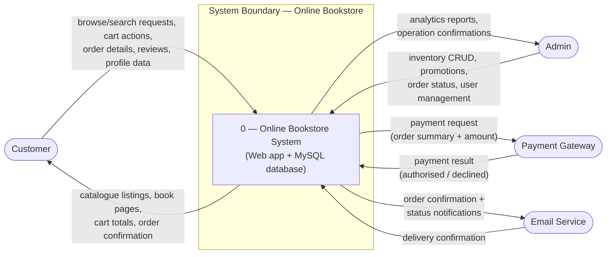

# 04 — Context Diagram (DFD Level 0)

The context diagram places the **Online Bookstore System** in its environment: one process (the whole system), four external entities, and the data flows between them.

## Diagram

## External entities

| External entity | Nature | Flows **in** to the system | Flows **out** to the entity |
|---|---|---|---|
| **Customer** | Person | Search & browse requests; cart operations; checkout details; reviews; profile updates | Catalogue pages; book details; cart totals; order confirmations; e-mails |
| **Admin** | Person | Inventory CRUD; promotion setup; order-status updates; user management; report requests | Analytics & inventory confirmations |
| **Payment Gateway** | External service | Payment result (approved/declined transaction) | Payment authorisation request |
| **Email Service** | External service | Delivery status of messages | Order confirmation & notification e-mails |

## Data flows (named)

| Flow | Direction | Content | Storage |
|---|---|---|---|
| Orders | Customer ↔ System | New order + line items at checkout | → `D4 Orders/Order Details` |
| Payments | System ↔ Gateway | Amount, order ref; authorisation result | transient |
| Catalogue updates | Admin ↔ System | New books, price/stock edits | → `D2 Books` |
| Confirmation e-mails | System → Email Service | Order id, status, customer e-mail | → external |

> **Convention:** external entities are drawn outside the single system process `0`; no data stores appear at Level 0. Level 1 (next document) decomposes process `0`.
