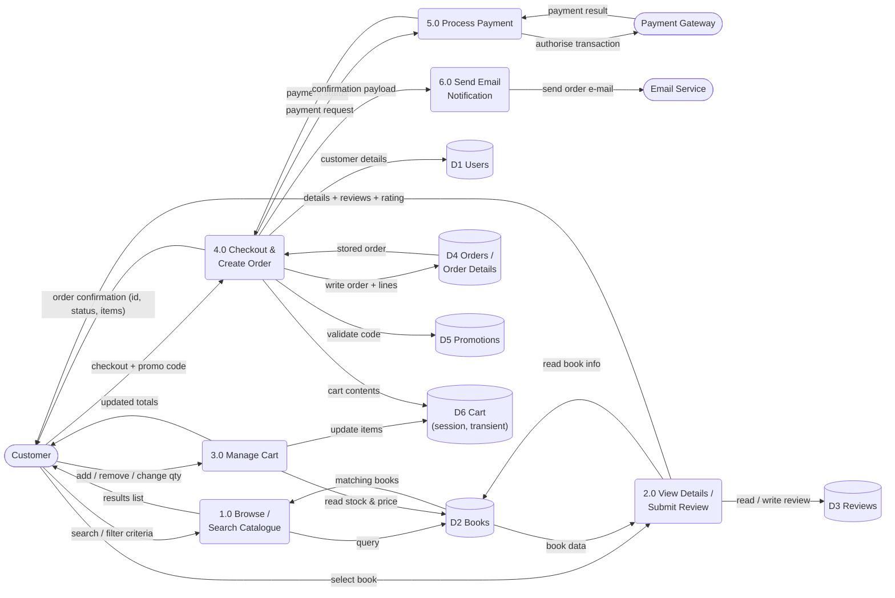
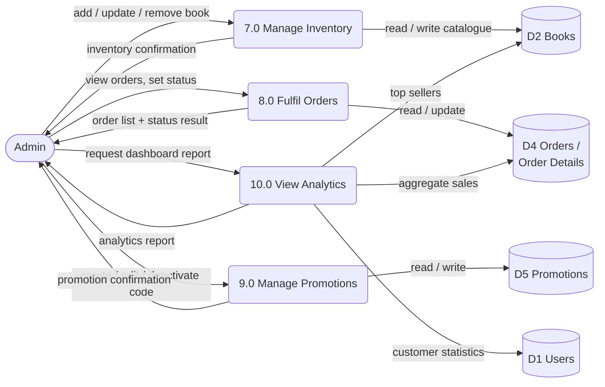

# 05 — Data Flow Diagram (DFD)

## Level 0 reminder
See [04-context-diagram.md](04-context-diagram.md) — a single process `0 — Online Bookstore System`.

## Level 1 — Customer / checkout processes (`1.0`–`6.0`)

## Level 1 — Administration processes (`7.0`–`10.0`)

## Process catalogue

| # | Process | Inputs | Outputs | Data stores |
|---|---|---|---|---|
| 1.0 | Browse / Search Catalogue | search & filter criteria (Customer) | filtered book list | **D2** Books (read) |
| 2.0 | View Details / Submit Review | book selection; new review (Customer) | details page w/ reviews & rating | **D2**, **D3** Reviews |
| 3.0 | Manage Cart | add/remove/qty (Customer) | updated cart & totals | **D2** (stock read), **D6** Cart* |
| 4.0 | Checkout & Create Order | checkout + promo (Customer) | stored order, payment request, confirmation | **D1**, **D4**, **D5**, **D6** |
| 5.0 | Process Payment | payment request (from 4.0) | payment status (to 4.0) | none (external gateway) |
| 6.0 | Send Email Notification | confirmation payload (from 4.0) | order e-mail via Email Service | none (external) |
| 7.0 | Manage Inventory | CRUD commands (Admin) | updated `books` | **D2** |
| 8.0 | Fulfil Orders | status updates (Admin) | updated `orders` | **D4** |
| 9.0 | Manage Promotions | promotion CRUD (Admin) | updated `promotions` | **D5** |
| 10.0 | View Analytics | report request (Admin) | dashboard report | **D1**, **D2**, **D4** |

\* **D6 Cart** is session state (PHP `$_SESSION`), not a MySQL table — kept visible in the DFD because data *does* flow and must be stored somewhere between requests.

## Data store dictionary

| Store | Contents | Written by | Read by |
|---|---|---|---|
| D1 Users | accounts, roles, profiles | 4.0 (register/profile) | 4.0, 10.0 |
| D2 Books | catalogue (title, author, genre, price, stock, ISBN) | 7.0 | 1.0, 2.0, 3.0, 10.0 |
| D3 Reviews | ratings & comments | 2.0 | 2.0 |
| D4 Orders / Order Details | order headers + line items | 4.0 | 4.0, 8.0, 10.0 |
| D5 Promotions | discount codes, validity | 9.0 | 4.0 |
| D6 Cart | session basket | 3.0 | 3.0, 4.0 |
