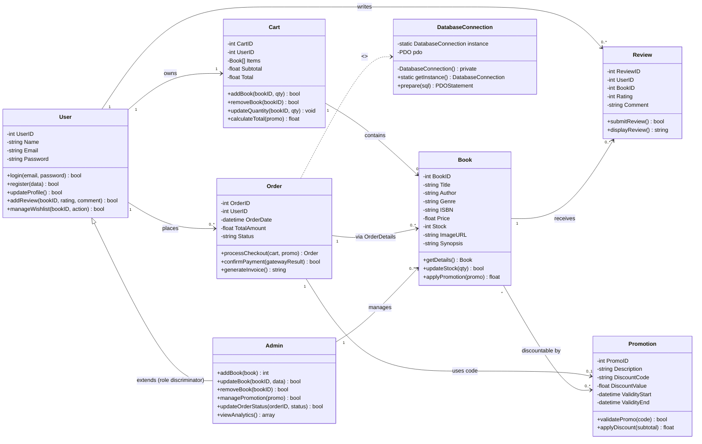

# 07 — Class Diagram (with Design Patterns)

## Domain class diagram

## Design-pattern mapping

### 1. Model–View–Controller (MVC)
The application is separated into three layers:

| Layer | Contents | Location in implementation |
|---|---|---|
| **Model** | `Book`, `User`, `Order`, `Cart`, `Review`, `Promotion` + persistence | `public/includes/` (DB access), MySQL tables |
| **View** | Homepage, Catalogue, Book Details, Cart, Checkout, Login/Register, Admin Panel | `public/*.php`, `public/admin/*.php`, `css/style.css` |
| **Controller** | PHP handlers (search, cart ops, checkout, CRUD) + client-side JavaScript | `public/api/*.php`, `public/js/main.js` |

Flow: **View** (HTML + JS) → user action → **Controller** (`api/*.php`) → **Model** (PDO queries) → response → **View** re-renders (dynamic HTML/JSON).

### 2. Singleton — `DatabaseConnection`
- Ensures **exactly one** MySQL (PDO) connection per request.
- Implemented with a private constructor + static `getInstance()` in `public/includes/db.php`.
- Prevents resource leaks and keeps credentials in one config point (`public/includes/config.php`).

### 3. Observer — Notifications
- **Subject:** `Order` (status changes: Pending → Paid → Shipped → Completed) and `Promotion` (new offers).
- **Observer:** the notification/email dispatcher; **Customers are the observers** who subscribed to updates.
- In the codebase this is realised when `Order::processCheckout()` / `confirmPayment()` writes a status change and triggers the e-mail routine (`Email Service`) that notifies the customer — matching the DFD's `4.0 → 6.0` flow.

## Relationships explained

| Relationship | Type | Rationale |
|---|---|---|
| `Admin` → `User` | inheritance | Admin *is-a* User with elevated role; single-table role discriminator. |
| `User` 1→N `Order` | aggregation | order history. |
| `Order` → `Book` via `OrderDetails` | composition | line items snapshot price/qty. |
| `User` 1→1 `Cart` | aggregation | session basket, not persisted. |
| `Promotion` → `Order` | association | discount code applied at checkout. |
| all persistence classes → `DatabaseConnection` | dependency | Singleton access point. |
